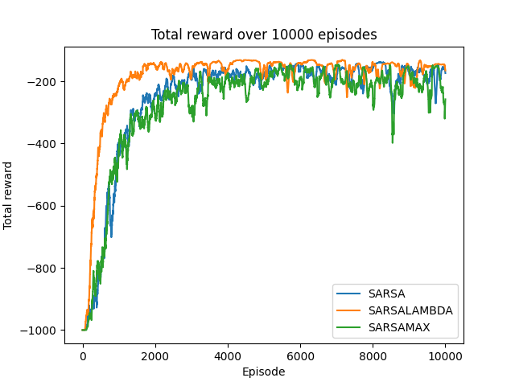

# Reinforcement Learning

The following details the process of training a model to tackle the
mountain car problem as described in Sutton & Barto's book *Reinforcement Learning*.

  

# The Mountain Car Problem

The problem begins with a car positioned deep within a valley. The goal is to reach the top of the hill to the right, however, the car's engine is not powerful enough to drive up the hill. Therefore, the car must use the hill to its left in order to gain enough momentum to reach the rightmost hill.

  

# Environment

This project makes use of [OpenAI's Gym toolkit](https://gym.openai.com/) which provides an environment for training reinforcement learning models.

  

# Algorithms

This project uses SARSA, Q-Learning(SARSAMAX), and SARSALAMBDA as described in Sutton & Barto's book *Reinforcement Learning* to train models to maximize score. Each of these algorithms use a greedy epsilon policy.

  

# Hypotheses

1. Q-Learning will maximize average reward over 10,000 episodes.
2. Using SARSA with various methods of epsilon decay denoted as 'Step,' 'Exponential,' and 'Static,' exponential will return the greatest average reward over 10,000 episodes

> Step epsilon decay is defined as epsilon = epsilon*0.99 every 20 episodes.
> Exponential epislon decay uses the exponential function to decay epsilon 
> over 10,000 episodes. Static epsilon maintains the same epsilon value of 0.2 
> over 10,000 episodes

  

# Results

| Algorithm | Mean | Std. Dev. |
| --------- | :--: | :-------: |
| SARSA     | -253.9 | 188.2   |
| SARSALAMBDA | -191.2 | 136   |
| Q-Learning | -276.7 | 178.9  |

In the above image we can see that SARSALAMBDA achieves the greatest average reward over 10,000 episodes. 

  

